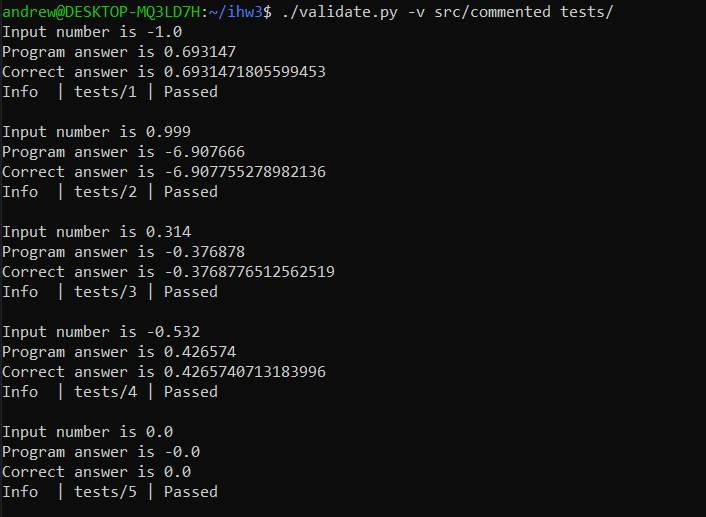
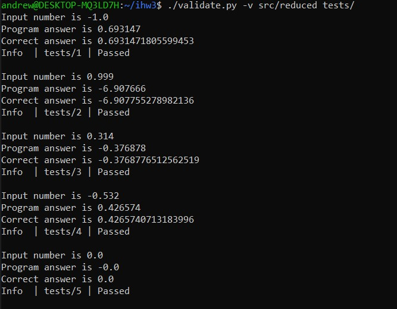
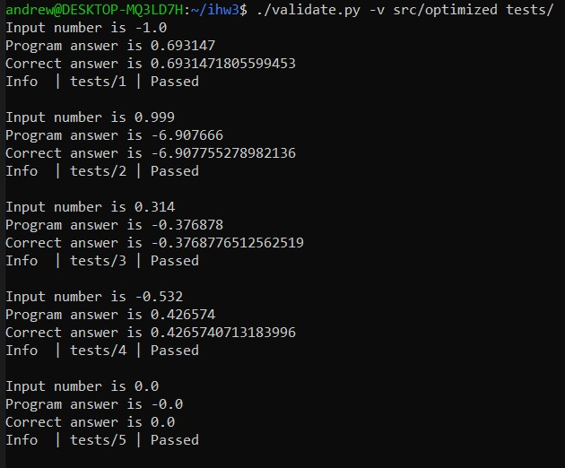
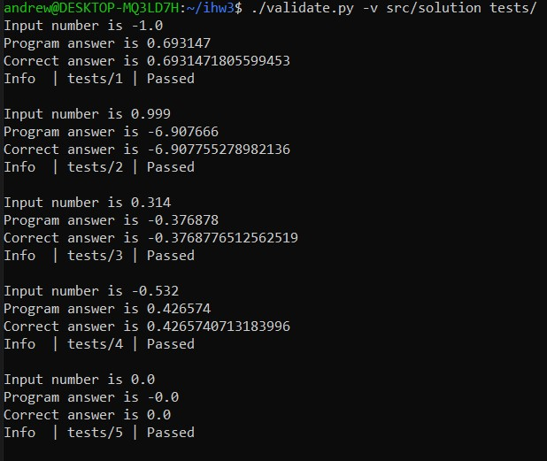
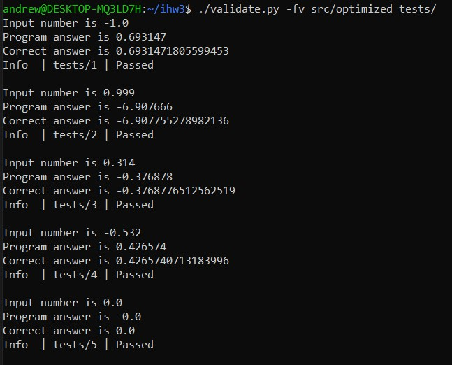
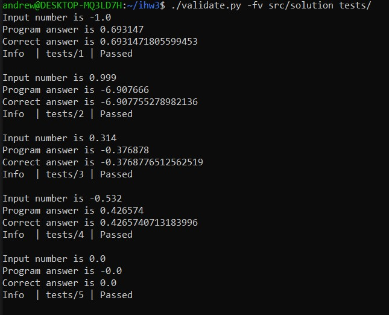
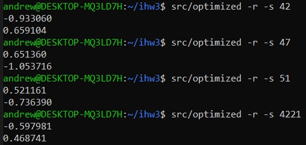
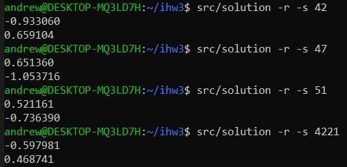

# Индивидуальное домашнее задание №3

#### Студент: Нечесов Андрей Львович
#### Группа: БПИ217
#### Вариант: 17

## Содержание
- [Условие к варианту](#условие-к-варианту)
- [Формат работы программы](#формат-работы-программы)
- [Тестирующий скрипт](#тестирующий-скрипт)
- [Критерии на 4 балла](#критерии-на-4-балла)
	- [Решение на C](#написано-решение-на-c)
	- [Программа на ассемблере](#комментарии-к-программе-на-ассемблере-и-компиляция-программы)
	- [Модификация программы](#из-ассемблерной-программы-убраны-лишние-макросы)
	- [Тестирование программ](#тестирование-программ)
- [Критерии на 5 баллов](#критерии-на-5-баллов)
- [Критерии на 6 баллов](#критерии-на-6-баллов)
	- [Рефакторинг программы на ассемблере](#рефакторинг-программы-на-ассемблере)
	- [Добавление комментариев в разработанную программу](#добавление-комментариев-в-разработанную-программу)
	- [Тестирование полученной программы](#тестирование-полученной-программы)
	- [Сопоставление размеров программ](#сопоставление-размеров-программ)
- [Критерии на 7 баллов](#критерии-на-7-баллов)
	- [Модульная программа](#модульная-программа)
	- [Файловый ввод и вывод](#файловый-ввод-и-вывод)
	- [Файлы для тестирования](#файлы-для-тестирования)
	- [Тестирование файлового ввода/вывода](#тестирование-файлового-вводавывода)
- [Критерии на 8 баллов](#критерии-на-8-баллов)
	- [Генератор случайных наборов данных](#генератор-случайных-наборов-данных)
	- [Замеры времени](#замеры-времени)
		- [Сравнительные таблицы](#сравнительные-таблицы)
- [Критерии на 9 баллов](#критерии-на-9-баллов)
	- [Уточнения](#уточнения)
	- [Сравнительный анализ по скорости и размеру](#сравнительный-анализ-по-скорости-и-размеру)
	- [Вывод](#вывод)

## Условие к варианту
>Разработать программу, вычисляющую с помощью степенного ряда
с точностью не хуже 0,1% значение функции ln(1-x) для входного
параметра x

Степенной ряд для данной сходится на полуинтервале [-1, 1), поэтому на входные данные наложено ограничение.  
Также согласно обсуждению в чате курса, необходимая точность = 0.1 / 100 = 0.001 &mdash; 3 знака полсе запятой.

## Формат работы программы
```
./solution [-i INPUT_FILE] [-o OUTPUT_FILE] [-s SEED] [-r] [-t TESTS_N]
```
`-i INPUT_FILE` указывает на то, что данные нужно читать с файла. В качестве аргумента требуется указать путь ко входному файлу.     
`-o OUTPUT_FILE` указывает на то, что данные нужно выводить в файл. В качестве аргумента опция требуется указать путь к выходному файлу.     
`-r` указывает на то, что программа сама должна сгенерировать данные.    
`-s SEED` семя рандома. В качестве аргумента нужно указать целое число от 1 до 1'000'000.  
`-t TESTS_N` указывает на то, что программа должна провести замер времени работы. В качестве аргумента опции необходимо передать количество тестов для замера времени. В консоль выводится суммарное время затраченное на `TESTS_N` тестов.

## Тестирующий скрипт
Для удобства тестирования программы был написан скрипт [validate.py](validate.py)
```
usage: validate.py [-h] [-f] [-v] path_to_program path_to_tests

Checker for IHW3

positional arguments:
  path_to_program
  path_to_tests

optional arguments:
  -h, --help       show this help message and exit
  -f, --use-files
  -v, --verbose
```

В папке с тестами файлы могут быть именованы любым образом, но их содержимое должно состоять из единственной строки с вещественным числом.

## Критерии на 4 балла
### Написано решение на C
Исходный монолитный код на языке C: [src/solution.c](src/solution.c)
### Комментарии к программе на ассемблере и компиляция программы

Трансформируем код написанный на языке C в язык ассемблера:
```console
gcc -masm=intel -fno-asynchronous-unwind-tables -fno-jump-tables -fno-stack-protector -fno-exceptions solution.c -S -o solution.s
```

Исходные тексты на ассемблере, сформированные компилятором языка C: [src/solution.s](src/solution.s)

Код на языке ассемблера прокомментирован: [src/commented.s](src/commented.s)

Откомпилируем полученную программу без использования отладочных и оптимизируюзих опций:
```console
gcc commented.s -o commented
```
 
### Из ассемблерной программы убраны лишние макросы
Часть работы уже была проделана опциями при трансформации. Теперь руками уберем из ассемблерной программы метаинформацию:
```assembly
	.ident	"GCC: (Ubuntu 9.4.0-1ubuntu1~20.04.1) 9.4.0"
	.section	.note.GNU-stack,"",@progbits
	.section	.note.gnu.property,"a"
	.align 8
	.long	 1f - 0f
	.long	 4f - 1f
	.long	 5
0:
	.string	 "GNU"
1:
	.align 8
	.long	 0xc0000002
	.long	 3f - 2f
2:
	.long	 0x3
3:
	.align 8
4:
```
И команду `endbr64`, которая обеспечивает дополнительную безопасность.

Итоговая модифицированная программа: [src/reduced.s](src/reduced.s)
### Модифицированная ассемблерная программа отдельно откомпилирована
```console
gcc reduced.s -o reduced
```

### Тестирование программ
Был составлен набор тестов для проверки работы программы на следующих входных данных:
1. Нижнняя граница полуинтервала [-1, 1)	
2. Число близкое к верхней границе полуинтервала [-1, 1)
3. Случайное положительное число из допустимого диапазона значений
4. Случайное отрицательное число из допустимого диапазона значений
5. Ноль
 

Все тесты лежат в папке [tests](tests/) и имеют в названии номер соответствующий списку выше.

Используем скрипт [validate.py](validate.py) с опцией `-v` для вывода подробных результатов тестирования:

```console
./validate.py -v src/commented tests/
./validate.py -v src/reduced tests/
```

Получаем одинаковые результаты тестирования для программ:
[commented.s](src/commented.s)            | [reduced.s](src/reduced.s)&nbsp;&nbsp;&nbsp;&nbsp;&nbsp;
:-------------------------:|:-------------------------:
  |  

## Критерии на 5 баллов
Программа на C изначально была написана так, что в ней использовались и локальные переменные, и вызовы функций с передачей параметров. Исходный код на языке ассемблера также содержит требуемые комментарии на оценку 5: [reduced.s](src/reduced.s)

## Критерии на 6 баллов
### Рефакторинг программы на ассемблере
В первую очередь оптимизация проводилась для функции `calculate`, от которой прямо зависит скорость решения задачи.

Так как функция `calculate` не вызывает других функций, удалось полностью перенести хранение локальных переменных со стека в регситры xmm8-xmm10 и r11.

### Добавление комментариев в разработанную программу
Исходный код оптимизированной программы: [optimized.s](src/optimized.s) (прокомментирован)

### Тестирование полученной программы
Для тестирования используем [validate.py](validate.py) и тесты из директории [tests](tests/)

Согласно условию будем сравнивать результаты тестовых прогонов модифицированной программы с результатами тестовых прогонов программы на языке C

```console
gcc src/solution.c -o src/solution
gcc src/optimized.s -o src/optimized
```

В первую очередь протестируем консольный ввод/вывод:
```console
./validate.py -v src/optimized tests/
./validate.py -v src/solution tests/
```
[optimized.s](src/optimized.s)            | [solution.c](src/solution.c)&nbsp;&nbsp;
:-------------------------:|:-------------------------:
  |  

Теперь проверим файловый ввод/вывод. Для этого запустим чекер с опцией `-f`:
```console
./validate.py -fv src/optimized tests/
./validate.py -fv src/solution tests/
```
[optimized.s](src/optimized.s)            | [solution.c](src/solution.c)&nbsp;&nbsp;
:-------------------------:|:-------------------------:
  |  

Не забудем проверить, что функции для генерации случайных тестов работают корректно:
```console
src/optimized -r -s 42
src/optimized -r -s 47
src/optimized -r -s 51
src/optimized -r -s 4221
src/solution -r -s 42
src/solution -r -s 47
src/solution -r -s 51
src/solution -r -s 4221
```
[optimized.s](src/optimized.s)            | [solution.c](src/solution.c)&nbsp;&nbsp;
:-------------------------:|:-------------------------:
  |  

Для всех тестовых прогонов получили одинаковый результат.

### Сопоставление размеров программ
Чтобы не учитывать строки с комментариями и прочие нюансы, будем сравнивать размеры исполняемых файлов при помощи утилиты `stat`:

```
cd src
gcc solution.c -o solution
gcc optimized.s -o optimized
stat --printf="size: %s bytes\n" solution
stat --printf="size: %s bytes\n" optimized
```
Получаем следующий результат:
<p align="center">

</p>

Вывод: оптимизированная программа имеет меньший размер, чем программа, полученная после трансформации в язык ассемблера компилятором языка C. Значит, оптимизация по размеру удалась :)

## Критерии на 7 баллов
### Модульная программа
Единицы компиляции располагаются в папке [modules/](modules/)  
Исходные тексты на языке ассемблера, сформированный компилятором языка C располагаются в папке [c_modules/asm_modules/](c_modules/asm_modules/)

Сборка программы:
```
cd modules
make obj
make solution
```

<p align="center">

</p>

### Файловый ввод и вывод
Ввод и вывод в файл осуществляется с помощью опций `-i` и `-o` соответственно:
<p align="center">

</p>

Командная строка проверяется на корректность числа аргументов и корректное открытие файлов:
<p align="center">

</p>

### Файлы для тестирования
Файлы были подготовлены ещё при выполнении критериев на 4 балла:
1. Нижнняя граница полуинтервала [-1, 1)	
2. Число близкое к верхней границе полуинтервала [-1, 1)
3. Случайное положительное число из допустимого диапазона значений
4. Случайное отрицательное число из допустимого диапазона значений
5. Ноль

Все тесты лежат в папке [tests](tests/) и имеют в названии номер соответствующий списку выше.

### Тестирование файлового ввода/вывода
Снова воспользуемся скриптом [validate.py](validate.py), который умеет тестировать файловый ввод и вывод, и укажем соответствующую опцию `-f`
```console
./validate.py -fv modules/solution tests/
```
<p align="center">

</p>

Программа успешно прошла тесты.


## Критерии на 8 баллов
### Генератор случайных наборов данных
Для генерации случайного набора данных программу нужно запустить с опцией `-r`. Для того чтобы программа генерировала разные числа, нужно воспользоваться опцией `s`, аргументом которой является целое неотрицательное число.

Приведем пару примеров использования генератора:
```console
./solution -r -s 42
./solution -r -s 50
./solution -r -s 53
```

<p align="center">

</p>

Можно комбинировать файловый вывод:
```console
./solution -r -s 42 -o out
cat out
```
<p align="center">

</p>

### Замеры времени
Для проведения замера времени программу нужно запустить с опцией `-t`, которая в качестве аргумента принимает количество повторений тестирования.

Проведем замеры для различных значений аргумента опции `-t`

#### Сравнительные таблицы
<details>
  	<summary>Вывод в консоли (кликабельно)</summary>
  	<p align="center">
		
	</p>
	<p align="center">
		
	</p>
</details>

| | t = 1000000 | t = 1500000 | t = 2000000 | t = 2500000 | t = 3000000 |
:----:|:----:|:----:|:----:|:----:|:----:
Время работы [optimized](src/optimized.s) (ms) | 2235 | 3485 | 4436 | 5637 | 6737
Время работы [solution](src/solution.s) (ms) | 3814 | 5929 | 7956 | 9678 | 13276 

<br>

<details>
  	<summary>Вывод в консоли (кликабельно)</summary>
  	<p align="center">
		
	</p>
</details>


| | [optimized](src/optimized.s) | [solution](src/solution.s) 
:----:|:----:|:----:|
Размер исполняемого файла (в байтах) | 17352 | 17640 

## Критерии на 9 баллов
### Уточнения
Подсчитвать размер исполняемого файла будем следующей командой:
```console
stat --printf="%s bytes\n" PATH_TO_EXECUTABLE
```

Из-за наличия комментариев в собственной программе, будем сравнивать размер ассемблерного кода по количеству строк, предварительно удалив строки-комментарии и пустые строки
```console
grep -v -e '^[[:space:]]*$' -e '^\s*#' PATH_TO_CODE > log_count
wc -l log_count
```

Кроме того, будем считать минимальное и максимальное время исполнения по 5 запускам 
```console
<executable> -r -t 3000000
```
### Сравнительный анализ по скорости и размеру 
`-O1`, `-O2`, `-O3` &mdash; опции для оптимизации по скорости, а `Os` &mdash; по размеру. Объединим полученные данные в одну табличку:
Программа | Используемые опции | Размер ассемблерного кода (в строках) | Размер исполняемого файла (в байтах) | Минимальное время исполнения, в миллисекундах | Максимальное время исполнения, в миллисекундах
:---:|:---:|:---:|:---:|:---:|:---:
[src/no_optimization/solution.s](src/no_optimization/solution.s) | &mdash; | 649 | 17640 | 11805 | 12009 
 [src/O3_optimization/solution.s](src/O3_optimization/solution.s)  | -O3 | 653 | 17672  | 6781 | 7048  
 [src/O2_optimization/solution.s](src/O2_optimization/solution.s)  | -O2 | 653 | 17672  | 6947 | 7131
 [src/O1_optimization/solution.s](src/O1_optimization/solution.s)  | -O1 | 560 | 17672 | 6714 | 7009
 [src/Os_optimization/solution.s](src/Os_optimization/solution.s)  | -Os | 513 | 17672 | 9046 | 9461
[src/optimized.s](src/optimized.s)  | &mdash; | 474 | 17352 | 6735 | 6883  

### Вывод
Модифицированная программа показала отличные результаты: она стала лидером не только по размеру ассемблерного и исполняемого файлов, но и смогла показать лучшие результаты по времени исполнения. ИДЗ удалось!! :)
